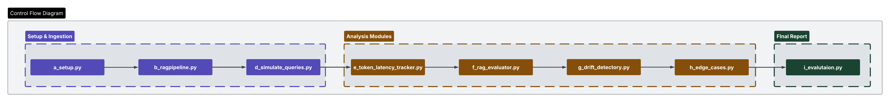
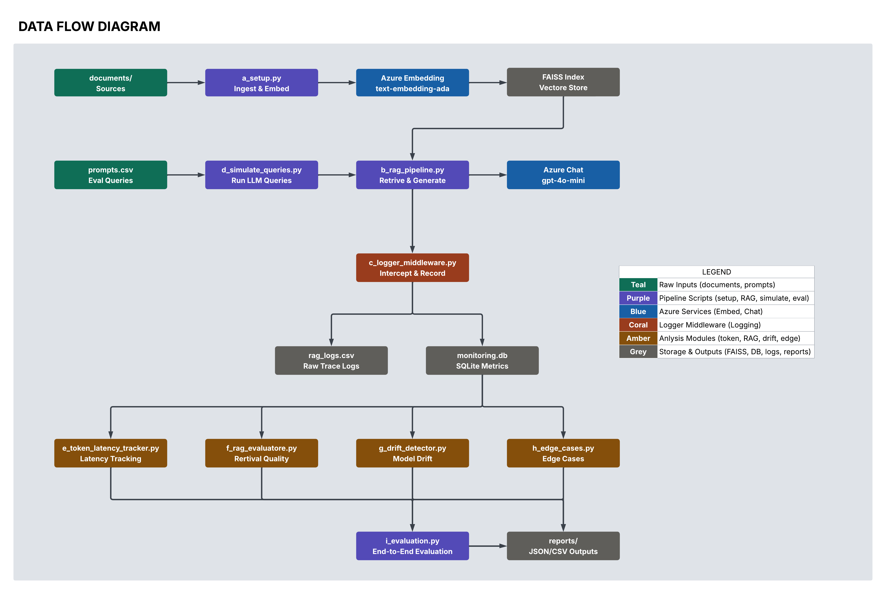
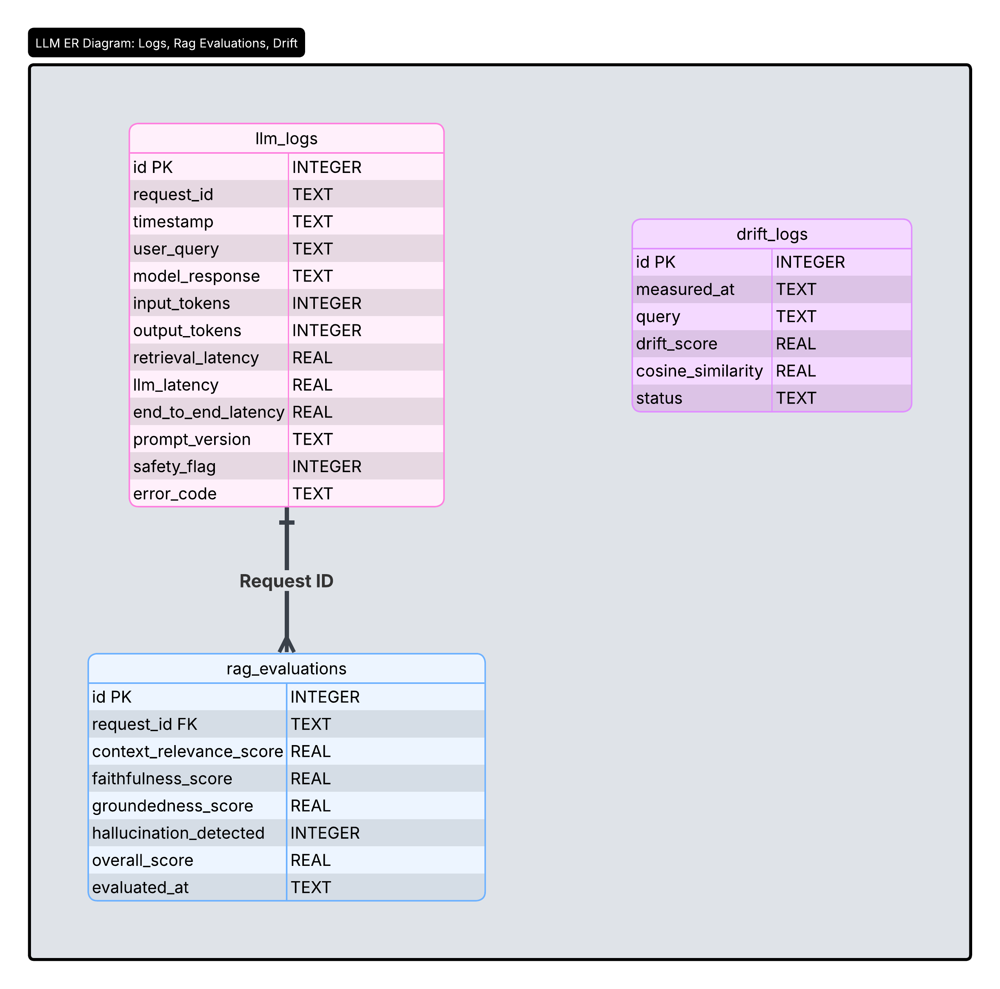

# Architecture Overview

## 1. Control Flow Diagram

The control flow diagram shows how the platform orchestrates the main processing steps across setup, retrieval-augmented generation, logging, simulation, evaluation, drift detection, edge case tracking, and the dashboard.

## 2. Data Flow Diagram

The data flow diagram illustrates the movement of documents, embeddings, prompts, logs, evaluation artifacts, and database state through the system.

## 3. ER Diagram

The ER diagram depicts the core entities and relationships used by the monitoring platform, including log tables, evaluation records, prompts, and reference queries.

## 4. Component Responsibilities

| Script | Reads | Writes | Azure OpenAI |
|--------|-------|--------|--------------|
| `a_setup.py` | `data/documents/` | `faiss_index/` | Embeddings |
| `b_rag_pipeline.py` | FAISS index | — | Embeddings + Chat |
| `c_logger_middleware.py` | RAG result | `llm_logs`, `rag_logs.csv` | — |
| `d_simulate_queries.py` | `prompts.csv` | via Logger | Indirect via RAG |
| `e_token_latency_tracker.py` | `llm_logs` | `task3_*.json` | — |
| `f_rag_evaluator.py` | `llm_logs` | `rag_evaluations`, `task4_*.json` | Chat (judge) |
| `g_drift_detector.py` | `reference_queries.json` | `drift_logs`, `drift_baseline.json`, `task5_*.json` | Embeddings |
| `h_edge_cases.py` | hardcoded prompts | `edge_cases_log.csv` via Logger | Indirect via RAG |
| `i_evaluation.py` | all three SQLite tables | `task7_*.json`, `task7_summary.txt` | — |
| `dashboard.py` | `monitoring.db`, all JSON reports | — | — |
| `config.py` | `.env` | — | — |
