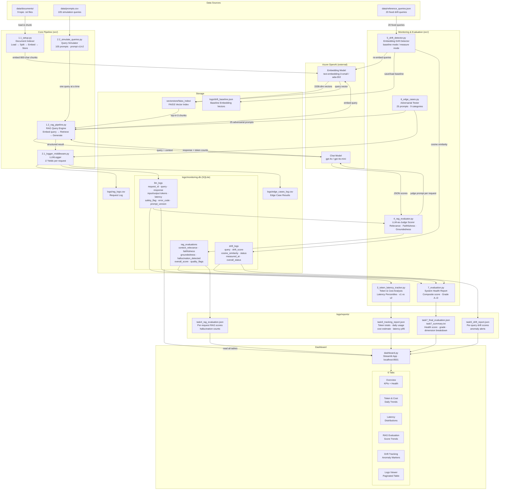
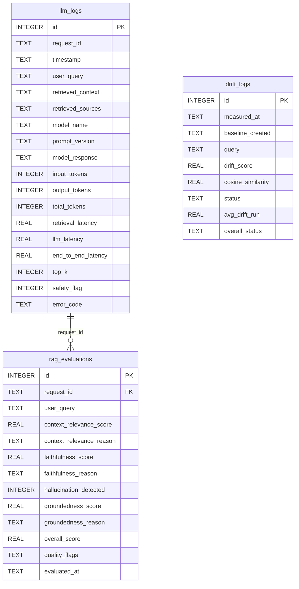
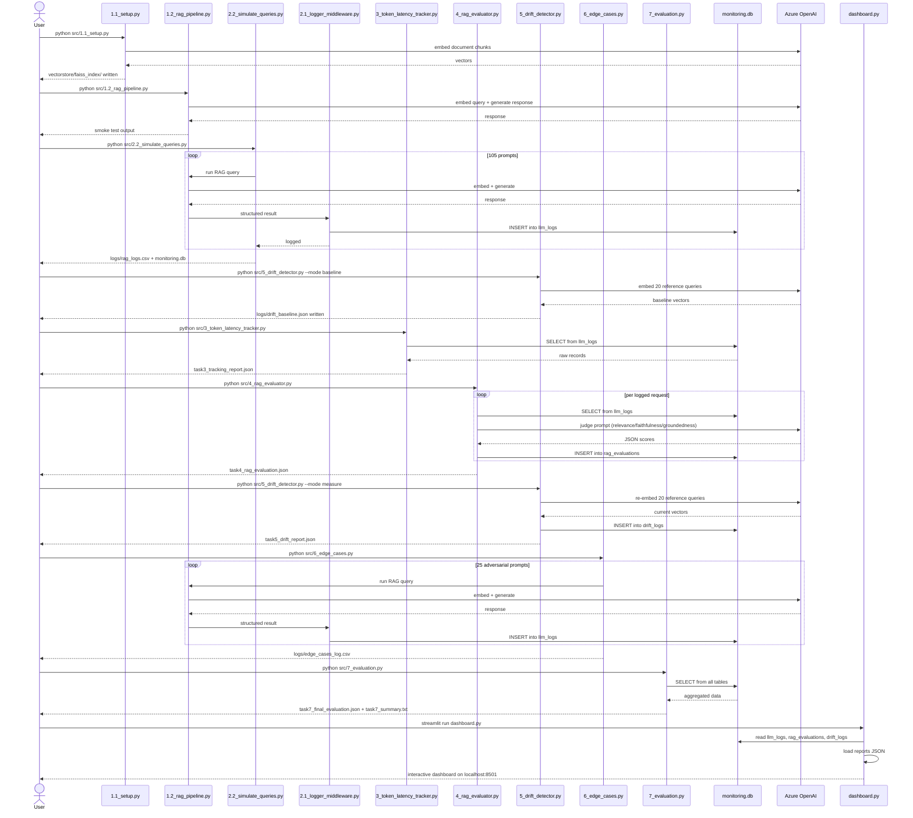

# System Architecture

This document describes the architecture of the LLM Monitoring Platform using Mermaid diagrams.

---

## 1. End-to-End Data Flow

The platform is organized as a sequential pipeline. Raw documents flow into a FAISS vector index; queries flow through the RAG engine and are logged to SQLite; monitoring scripts read from SQLite and write reports; the Streamlit dashboard consumes everything.

---

## 2. SQLite Database Schema

Three tables are written by different pipeline stages and read by monitoring scripts and the dashboard.

---

## 3. Task Execution Sequence

Scripts must be run in order; each step produces artifacts consumed by later steps.

---

## 4. Component Responsibilities

| Component | Reads | Writes | Azure OpenAI calls |
|-----------|-------|--------|--------------------|
| `1.1_setup.py` | `data/documents/` | `vectorstore/faiss_index/` | Embeddings |
| `1.2_rag_pipeline.py` | FAISS index | — | Embeddings + Chat |
| `2.1_logger_middleware.py` | RAG result dict | `llm_logs`, `rag_logs.csv` | None |
| `2.2_simulate_queries.py` | `data/prompts.csv` | via Logger | Indirect via RAG |
| `3_token_latency_tracker.py` | `llm_logs` | `task3_*.json` | None |
| `4_rag_evaluator.py` | `llm_logs` | `rag_evaluations`, `task4_*.json` | Chat (judge) |
| `5_drift_detector.py` | `reference_queries.json`, baseline | `drift_logs`, `task5_*.json`, baseline | Embeddings |
| `6_edge_cases.py` | hardcoded prompts | `edge_cases_log.csv` via Logger | Indirect via RAG |
| `7_evaluation.py` | all three SQLite tables | `task7_*.json`, `task7_summary.txt` | None |
| `dashboard.py` | `monitoring.db`, all JSON reports | — | None |
